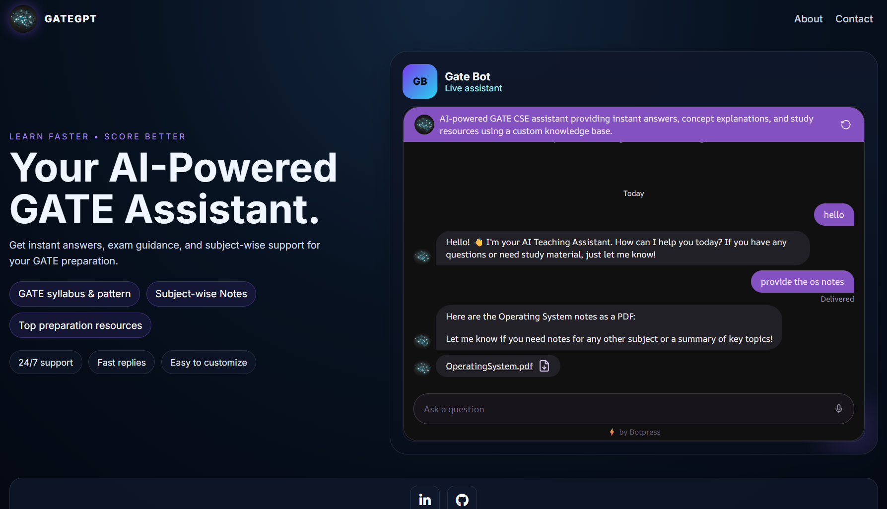

# 🤖 GateBot - AI Powered GATE CSE Assistant



## 📌 Overview

**GateBot** is an AI-powered learning assistant designed for **GATE Computer Science Engineering (CSE) aspirants**.  
It uses a custom knowledge base with conversational AI capabilities to answer subject-related queries, explain concepts, and provide quick access to relevant preparation resources.

The goal of this project is to make exam preparation more interactive, accessible, and efficient using AI-driven assistance.


---

## 🚀 Features

- 🤖 AI-powered conversational assistant
- 📚 Custom GATE CSE knowledge base integration
- ⚡ Instant doubt-solving and concept explanations
- 🔍 Subject-focused query handling
- 📖 Quick access to study resources
- 🌐 Embedded AI chatbot web interface
- 🎨 Modern responsive UI design


---

## 🛠️ Tech Stack

### 🤖 AI & Automation
- Botpress AI Agent
- Custom Knowledge Base
- Natural Language Processing

### 🌐 Frontend
- HTML5
- CSS3
- JavaScript

### 🔧 Tools & Platforms
- GitHub
- Botpress Cloud
- Webchat Integration


---

## ⚙️ System Workflow

```text
User Query
    |
    ↓
GateBot Web Interface
    |
    ↓
Botpress AI Agent
    |
    ↓
Knowledge Base Retrieval
    |
    ↓
AI Processing
    |
    ↓
Context-Aware Response
    |
    ↓
User Receives Answer
```

---

## 📚 Knowledge Base Coverage

GateBot is powered by curated Computer Science resources covering major GATE CSE subjects:

- 📌 Data Structures & Algorithms
- 📌 Database Management Systems
- 📌 Operating Systems
- 📌 Computer Networks
- 📌 Computer Organization & Architecture
- 📌 Theory of Computation
- 📌 Compiler Design
- 📌 Programming Concepts


---

## 🎯 Purpose

This project demonstrates how AI agents can enhance digital learning by combining:

- Intelligent query understanding
- Structured academic resources
- Automated response generation
- User-friendly conversational experience


---

## 📸 Project Preview

<p align="center">
  
</p>


---

## 🔮 Future Enhancements

- 🚀 Add personalized learning recommendations
- 📊 Track student preparation progress
- 📝 Add quiz and practice modules
- 🎯 Improve response personalization
- 📱 Enhance mobile experience


---

## 👨‍💻 Developer

**Sajid Saleem**

- GitHub: [Sajid-1101](https://github.com/Sajid-1101)
- LinkedIn: [Sajid Saleem](https://www.linkedin.com/in/sajid-saleem-5742433b2/)


---

## ⭐ Support

If you find this project useful, consider giving the repository a ⭐.
